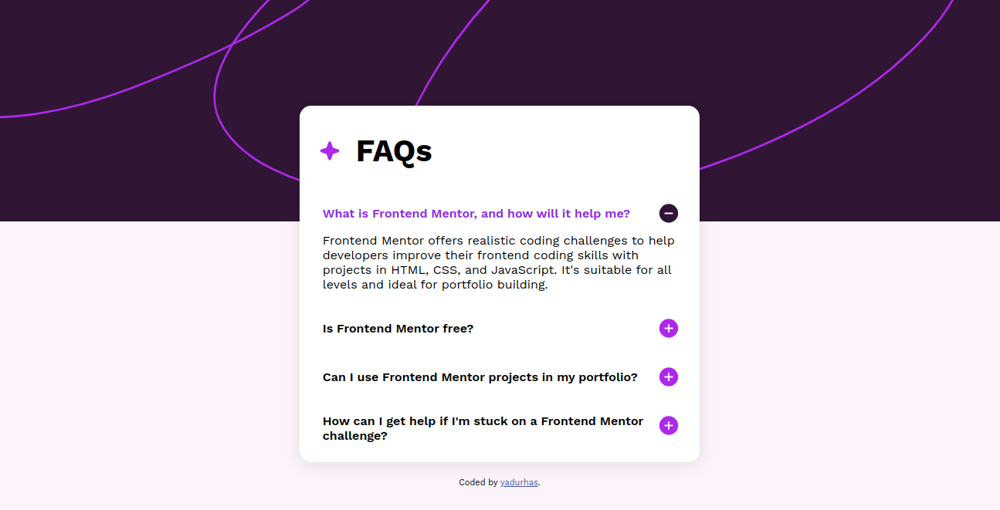

# Frontend Mentor - FAQ accordion solution

This is a solution to the [FAQ accordion challenge on Frontend Mentor](https://www.frontendmentor.io/challenges/faq-accordion-wyfFdeBwBz). 

## Overview

### The challenge

Users should be able to:

- Hide/Show the answer to a question when the question is clicked
- Navigate the questions and hide/show answers using keyboard navigation alone
- View the optimal layout for the interface depending on their device's screen size
- See hover and focus states for all interactive elements on the page

### Screenshot



### Links

- Solution URL: [Web Page](https://html-preview.github.io/?url=https://github.com/yadurhas/FAQ-sample-page/blob/main/faq-accordion-main/index.html)

## My process

Built out the divs to meet the requirements. Added CSS and JS on top of it.

## My Learnings

* dealing with "tab" clicks from keyboard and making the webpage, specifically the FAQs navigable with keyboard.
* Maintain that the "tab" clicks don't handover the focus outside the webpage, achieved this with assigning event handlers to focusable elements and ensuring that "tab" click only change focus among the focusable elements.
* using z-index to place one div over another div; both divs need to have non static positions in their CSS.
* using ```display:"none"``` and changing that property on click event handler in JS to make answer to the FAQ appear and disappear as needed. 

### Built with

- Semantic HTML5 markup
- CSS custom properties
- Flexbox
- JS

### Continued development

Need to update this page, so as to accomodate responsive design


## Author

- Github - [yadurhas]([https://www.your-site.com](https://github.com/yadurhas))
